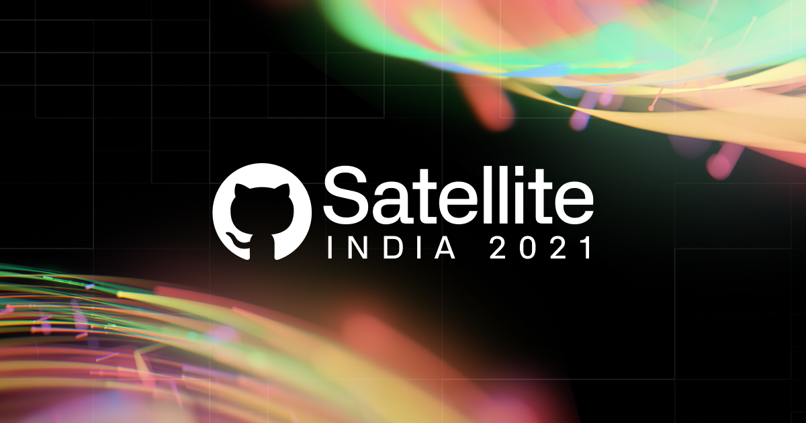

[https://githubsatellite.com/](https://githubsatellite.com/)
&nbsp;•&nbsp;
[Schedule](https://githubsatellite.com/schedule/)
&nbsp;•&nbsp;
[Speakers](https://githubsatellite.com//speakers/)
&nbsp;•&nbsp;
[Discussions](https://github.com/github/india/discussions)

 

[GitHub Satellite India 2021](https://githubsatellite.com/) is a free virtual event dedicated to celebrating India’s developer community featuring developers working together on the world’s software, announcements from the GitHub team, and inspiring performances by artists who code.

## Watch live

Join us and [watch the live stream here](https://githubsatellite.com/). All of the sessions will be available on demand after the event.

## Join the discussion

[Chat live now!!](https://github.com/github/india/discussions)

We've enabled our Discussions on this repository for you to ask questions about each session. Engineering teams and GitHub experts across the world will be online during each of the sessions. 

Head to [the Discussions tab](https://github.com/github/india/discussions) to take part!

As well as the Hubbers answering questions online, during each session, your hosts will be picking questions from the discussions thread to ask the presenter as part of the live-stream so please do join in!

Remember though, we want to keep the discussions area a friendly and welcoming place for everyone taking part in the event. Therefore please respect the event code of conduct and be awesome to each other.

All the session recordings will be available after the event. The discussion area will be for live interaction and Q&A for session themes and topics. We aim to do our best to answer most questions but it's possible not all questions will get answered. We will be locking the discussions to make them read-only after the event so you’ll be able to refer back to them after Satellite has ended.
